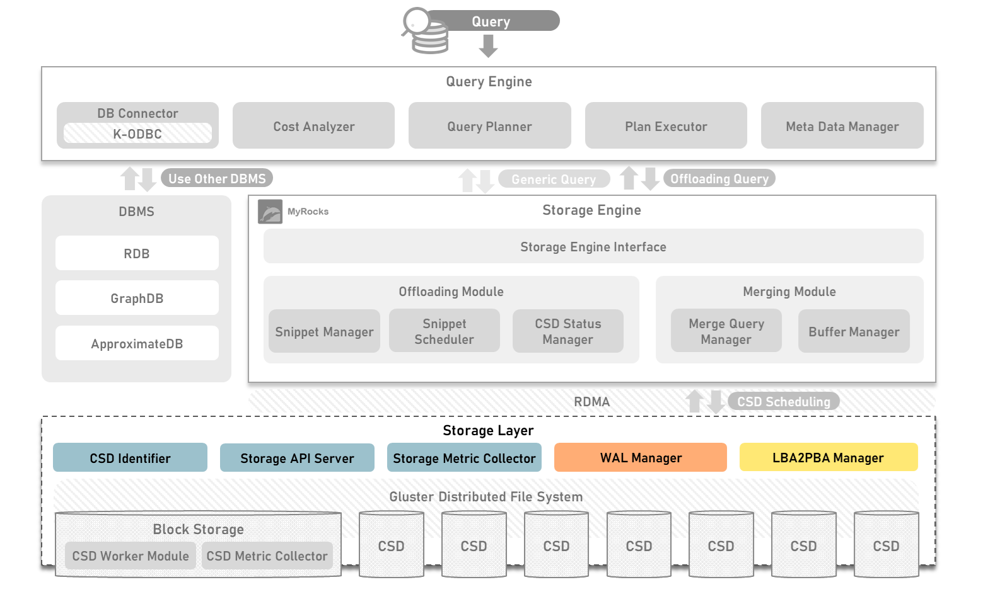

## Introduction of OpenCSD KETI-Storage-Controller-Module
-------------

The KEIT-Storage-Controller-Module is designed for operating on the storage layer.

Developed by KETI



## Contents
-------------
[1. Requirement](#requirement)

[2. Required Module](#required-module)

[3. Script For Running Module](#yaml-file-to-run-on-kubernetes-cluster)

[4. How To Install](#module-description-and-how-to-create-a-container)

[5. Governance](#governance)

## Requirement
-------------
>   Ubuntu 18.04.2 LTS

>   RapidJSON

>   Cmake >= 3.24

>   libprotoc >= 3.19

>   gcc >= 11.04

## Required Module
- *[KETI-Block-Storage-Module](https://github.com/opencsd/KETI-Block-Storage-Module)*

## Yaml file to run on Kubernetes cluster
- *[KETI-Storage-Controller](https://github.com/opencsd/OpenCSD-Storage-Controller)*

## Module description and how to create a container
-------------
```bash
git clone https://github.com/opencsd/KETI-Storage-Controller-Module
cd KETI-Storage-Engine-Instance
```

### CSD-Identifier
-------------
Receive snippets passed from storage engine and pass them to scheduled Computational Storage Device.
```bash
cd KETI-Storage-Engine-Instance/CSD-Identifier
./1.build.sh
```

### LBA2PBA-Manager
-------------
Convert logical block addresses to physical block addresses within storage.
```bash
cd KETI-Storage-Engine-Instance/LBA2PBA-Manager
./1.build.sh
```

### Storage-API-Server
-------------
Providing APIs related to storage layer.
```bash
cd KETI-Storage-Engine-Instance/Storage-API-Server
./1.build.sh
```

### Storage-Metric-Collector
-------------
CSD Metric Reception and Resource Collection and Storage of Storage Nodes.
```bash
cd KETI-Storage-Engine-Instance/Storage-Metric-Collector
./1.build.sh
```


## Governance
-------------
This work was supported by Institute of Information & communications Technology Planning & Evaluation (IITP) grant funded by the Korea government(MSIT) (No.2021-0-00862, Development of DBMS storage engine technology to minimize massive data movement)

